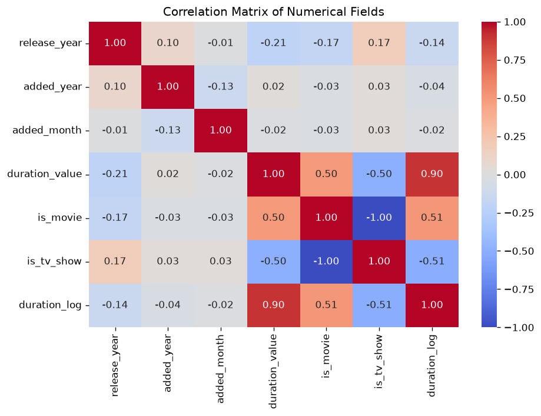
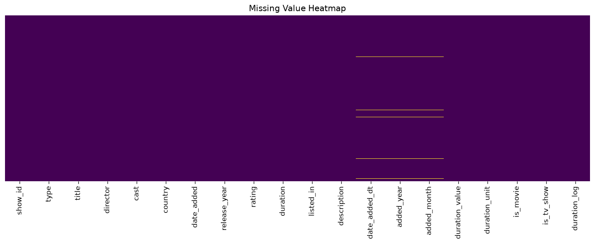

<div align="center">

# Clean and Preprocess a Dataset using Pandas and NumPy


**A reproducible data-cleaning and preprocessing pipeline for the Netflix Movies & TV
Shows dataset — Assignment 2 of the AI/ML Internship.**

[GitHub Repository](https://github.com/shubhu-io/data-cleaning-preprocessing)

</div>

---

## Table of Contents

- [Overview](#overview)
- [Problem Statement](#problem-statement)
- [Features](#features)
- [Technologies](#technologies)
- [Dataset](#dataset)
- [Project Structure](#project-structure)
- [Installation](#installation)
- [How to Run](#how-to-run)
- [Sample Output](#sample-output)
- [How to Run Tests](#how-to-run-tests)
- [Results](#results)
- [Limitations](#limitations)
- [Future Improvements](#future-improvements)
- [Author](#author)
- [Assignment Requirement Coverage](#assignment-requirement-coverage)

## Overview

Raw public datasets are messy: they contain missing values, duplicates, wrong data types
and inconsistent text. This project builds a **step-by-step, reproducible cleaning and
preprocessing pipeline** using Pandas and NumPy that turns the raw Netflix titles CSV into
an analysis- and ML-ready dataset, with a visual and numeric report at every step.

## Problem Statement

Use Pandas and NumPy in Python to clean and preprocess a real-world dataset (Netflix
Movies & TV Shows), documenting every step of the process.

## Features

- Step 1: Load the dataset with Pandas (CSV)
- Step 2: Inspect missing values, duplicates and data types
- Step 3: Handle missing values (drop fully-empty rows; fill `Unknown`/`Not available`)
- Step 4: Remove duplicate records
- Step 5: Convert data types (date parsing; `90 min` / `2 Seasons` → numeric duration)
- Step 6: NumPy numerical transformations (percentiles, std, mean-imputation, log feature)
- Step 7: Pandas filtering, sorting and grouping
- Summary statistics (`describe`)
- Bonus: null-value heatmap, correlation matrix, label encoding + one-hot ML-readiness
- Full pipeline exposed as a Python script **and** an executed Jupyter notebook

## Technologies

- Python 3.9+
- Pandas, NumPy
- Matplotlib, Seaborn (visual insights)
- Jupyter (nbformat/nbclient) for the notebook deliverable

## Dataset

- **Name:** Netflix Movies and TV Shows
- **Columns:** show_id, type, title, director, cast, country, date_added, release_year,
  rating, duration, listed_in, description
- **Rows:** 7,787 (raw)

## Dataset Source

- Kaggle: <https://www.kaggle.com/datasets/shivamb/netflix-shows>
- Public file bundled at `data/raw/netflix_titles.csv` (TidyTuesday public mirror).

## Project Structure

```
02-data-cleaning-preprocessing/
├── scripts/
│   ├── run_cleaning.py        # End-to-end pipeline runner
│   └── make_notebook.py       # Builds + executes the notebook
├── notebooks/
│   └── data_cleaning_preprocessing.ipynb   # Executed deliverable
├── src/
│   ├── __init__.py
│   └── cleaning.py            # All cleaning/preprocessing functions
├── data/
│   ├── raw/netflix_titles.csv             # Input dataset
│   └── processed/netflix_titles_clean.csv # Pipeline output
├── reports/figures/
│   ├── null_heatmap.png
│   └── correlation_matrix.png
├── tests/
│   └── test_cleaning.py
├── requirements.txt
└── .gitignore
```

## Installation

```bash
cd projects/02-data-cleaning-preprocessing
python -m venv .venv
# Windows:
.venv\Scripts\activate
# macOS/Linux:
source .venv/bin/activate
pip install -r requirements.txt
```

## How to Run

Run the full pipeline:

```bash
python scripts/run_cleaning.py
```

Regenerate and execute the notebook:

```bash
python scripts/make_notebook.py
```

Open the notebook:

```bash
jupyter notebook notebooks/data_cleaning_preprocessing.ipynb
```

## Sample Output

Figures generated by the cleaning/preprocessing report:





## How to Run Tests

```bash
python -m pytest tests/ -v
```

## Results

- Raw shape `(7787, 12)` cleaned to an ML-ready `(7787, 38)` frame.
- Fully-empty rows and duplicate rows removed; no missing values remain.
- Key insights (computed from the real data):
  - United States (2,555 titles) and India (923 titles) dominate the catalog.
  - Median movie duration ≈ 88 minutes.
  - Most titles were added between 2018–2021.
- Figures: `reports/figures/null_heatmap.png`, `reports/figures/correlation_matrix.png`.

## Limitations

- `date_added` uses forward-fill for gaps; ~88 rows remain `Not available`.
- The country column can list multiple countries; treated as a single label here.
- Label encoding is order-arbitrary (suited to tree models, not linear ones).

## Future Improvements

- Split multi-country values into separate rows/columns
- Apply target- or frequency-encoding instead of label encoding
- Add a dashboard page to interactively explore the cleaned data

## Author

Submitted as part of the AI/ML Internship assignments (NDVTechsys).

## Assignment Requirement Coverage

| Requirement | Implementation |
| --- | --- |
| Load dataset using Pandas | `src/cleaning.py` (`load_data`) |
| Inspect missing/duplicates/data types | `missing_values_table`, `duplicate_count`, `data_type_report` |
| Handle missing values | `handle_missing_values` |
| Remove/correct duplicates | `remove_duplicates` |
| Convert data types | `parse_date_added`, `extract_duration`, `convert_types` |
| NumPy numerical transformations | `numpy_transformations` |
| Filtering/sorting/grouping | `filter_movies_after_year`, `sort_by_release_year`, `group_by_country` |
| Summary statistics | `summary_statistics` |
| Bonus: null heatmap | `plot_null_heatmap` |
| Bonus: correlation matrix | `plot_correlation_matrix` |
| Bonus: ML-readiness encoding | `label_encode`, `top_country_encoding` |
